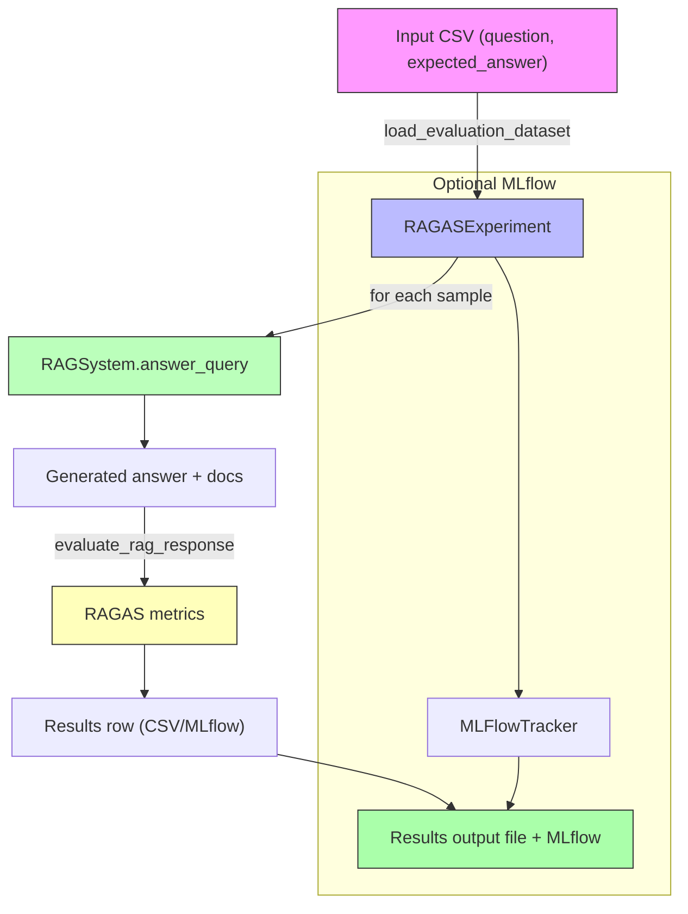

# Evaluation Layer (RAGAS Experiment)

This document describes the evaluation layer used in the `rag-assistant-fastapi` project. It focuses on how evaluations are structured, how data flows through the system, and how the evaluation results are generated, stored, and reported.

---

## 🧠 Architecture Outline

The evaluation layer is built around the `RAGASExperiment` class, which orchestrates:

- Loading a dataset of question/expected-answer pairs
- Running the RAG system to generate answers + retrieve context
- Scoring the response using RAGAS metrics
- Logging the results to CSV and (optionally) MLflow

### Core Components

- **`RAGASExperiment`**: Core orchestration class
- **`RAGSystem`**: Generates answers and retrieves documents
- **`ragas.evaluate`**: Computes RAGAS metrics
- **`MLFlowTracker`**: (Optional) logs runs & artifacts to MLflow

---

## ✅ Main Features

- ✅ **Batch evaluation** from a CSV dataset
- ✅ **Synchronous and asynchronous** execution modes
- ✅ **Per-sample logging** (including errors) and post-run summary
- ✅ **Configurable metric weights** for a unified score
- ✅ **MLflow integration** (runs, nested runs, metrics, artifacts)
- ✅ **Automatic error handling** for evaluation failures

---

## 🔁 Data Flow (Mermaid)



---

## 🏗 Implementation Overview

### 1) Dataset Loading

`RAGASExperiment.load_evaluation_dataset(csv_path)`:

- Reads a CSV file
- Requires columns: `question`, `expected_answer`
- Produces a list of sample dicts used for evaluation

### 2) Running a Single Sample

`RAGASExperiment._evaluate_sample(idx, sample)`:

1. Runs `RAGSystem.answer_query()` to get a `RAGResponse`:
   - `answer`, `retrieved_documents`, `reranked_documents`, timings
2. Computes evaluation via `evaluate_rag_response()`
3. Converts evaluation scores into a row dict for persistence
4. Optionally logs metrics/artifacts to MLflow
5. Catches exceptions and returns a safe error row

### 3) RAGAS Metrics Evaluation

`RAGASExperiment.evaluate_rag_response()`:

- Builds a small `datasets.Dataset` with the correct schema (`question`, `answer`, `contexts`, `ground_truth`)
- Applies RAGAS metrics:
  - `context_precision`
  - `context_recall`
  - `answer_relevancy`
  - `faithfulness`
- Returns a score dict and computes a weighted average

### 4) Batch Execution Modes

#### Synchronous
- `run_experiment()` iterates over samples sequentially

#### Asynchronous
- `run_experiment_async()` executes samples concurrently using `asyncio` + threadpool
- Uses a semaphore to limit concurrency

---

## ▶ Usage

### Run a standard evaluation

```bash
python run_evaluation_experiment.py --output evaluation_results
```

### Run asynchronously with concurrency

```bash
python run_evaluation_experiment.py --output ragas_evals_v2 --async --concurrency 5
```

### Review results

- Results file: `evaluation_results/ragas_evaluation_<timestamp>.csv`
- If MLflow is enabled:
  - Start MLflow UI: `mlflow ui`
  - Open in browser: `http://127.0.0.1:5000`

---

## 🔧 Further Improvements

### ✅ Harden evaluation input schema
- Validate that dataset rows include required fields
- Fail fast with a clear message if the CSV is malformed

### ✅ Add configurable metric weights
- Expose weights through CLI options or config file

### ✅ Add structured logging for errors
- Persist error type + stack trace per sample

### ✅ More robust context sizing
- Automatically choose top `k` docs based on retrieval score
- Make `k` a configurable parameter

### ✅ Auto-retry on transient failures
- Retry evaluation steps on transient network or LLM failures

### ✅ Add unit tests
- Test `evaluate_rag_response()` output shapes and error handling
- Test dataset loading and malformed CSV conditions

---

## 🧩 Where to Look in Code

- `evaluation_experiment.py` → main evaluation orchestration
- `app/rag_system.py` → RAG query / retrieval implementation
- `app/logging/mlflow_tracker.py` → MLflow logging logic

---

