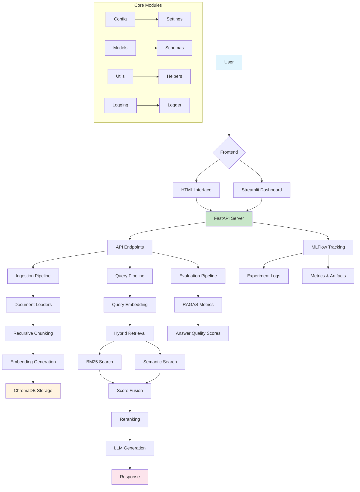

# RAG Assistant FastAPI

A production-ready, modular Retrieval-Augmented Generation (RAG) system built with FastAPI, featuring advanced chunking, hybrid retrieval, evaluation metrics, and multiple frontend interfaces. Designed for scalable document processing, semantic search, and AI-powered question answering.

## Features

- **Modular Architecture**: Clean separation of concerns with dedicated modules for ingestion, embeddings, retrieval, reranking, generation, and evaluation.
- **Advanced Document Processing**: Recursive text chunking with semantic boundary preservation, support for PDFs, CSVs, DOCX, URLs, and plain text.
- **Hybrid Retrieval**: Combines semantic vector search with BM25 keyword matching for optimal relevance.
- **Reranking**: Cross-encoder based reranking for improved answer quality.
- **LLM Integration**: Lightweight SmolLM2 model for efficient generation on various devices (CPU/GPU/MPS).
- **Evaluation Framework**: RAGAS metrics for comprehensive answer quality assessment.
- **Experiment Tracking**: MLFlow integration for monitoring and analysis.
- **Multiple Frontends**: Web-based HTML interface and interactive Streamlit dashboard.
- **RESTful API**: FastAPI-powered endpoints for all operations.
- **Persistent Storage**: ChromaDB vector database with metadata support.
- **Production Ready**: Configurable settings, logging, error handling, and scalability considerations. 

## Architecture

The system follows a modular pipeline architecture with clear separation between data ingestion, retrieval, and generation components.



### Component Details

#### 1. **API Layer** (`app/api/`)
- **FastAPI Application**: RESTful endpoints with automatic OpenAPI documentation.
- **Static File Serving**: Hosts HTML frontend at `/frontend`.
- **CORS Support**: Configured for cross-origin requests.
- **Request Validation**: Pydantic models for all inputs/outputs.

#### 2. **Document Ingestion** (`app/ingestion/`)
- **Multiple Loaders**: PDF, CSV, DOCX, URL, DataFrame, and plain text support.
- **Recursive Chunking**: Intelligent text splitting preserving semantic boundaries (200 char chunks, 40 char overlap).
- **Unique ID Generation**: Document ID + chunk index + content hash for ChromaDB compatibility.
- **Metadata Preservation**: Maintains source information and custom metadata.

#### 3. **Embeddings** (`app/embeddings/`)
- **Sentence Transformers**: all-MiniLM-L6-v2 model (384 dimensions).
- **Batch Processing**: Efficient encoding of multiple texts.
- **Device Agnostic**: Supports CPU, GPU, and MPS acceleration.

#### 4. **Vector Storage** (`app/storage/`)
- **ChromaDB**: Persistent vector database with HNSW indexing.
- **Upsert Operations**: Handles duplicate prevention with unique IDs.
- **Metadata Filtering**: Query-time filtering capabilities.
- **Collection Management**: Organized storage with collection namespacing.

#### 5. **Retrieval Strategies** (`app/retrieval/`)
- **Semantic Retrieval**: Cosine similarity on embeddings.
- **BM25 Retrieval**: TF-IDF based keyword matching.
- **Hybrid Retrieval**: Weighted combination (default: 60% semantic, 40% BM25).
- **Score Normalization**: Min-max scaling for fusion.

#### 6. **Reranking** (`app/reranking/`)
- **Cross-Encoder Model**: mmarco-MiniLMv2-L12-H384-v1 for pairwise scoring.
- **Top-K Selection**: Re-ranks retrieved documents for quality.
- **Threshold Filtering**: Optional score-based filtering.

#### 7. **Generation** (`app/generation/`)
- **SmolLM2-1.7B-Instruct**: Lightweight transformer model.
- **Context-Aware Prompting**: Structured prompts with retrieved context.
- **Configurable Parameters**: Temperature, max tokens, device selection.

#### 8. **Evaluation** (`app/evaluation/`)
- **RAGAS Framework**: Comprehensive metrics suite.
  - Answer Relevancy: Semantic similarity to query.
  - Faithfulness: Factual consistency with context.
  - Context Precision: Retrieved document relevance.
  - Context Recall: Ground truth coverage.
- **Batch Evaluation**: Process multiple query-answer pairs.
- **CSV Export**: Results saved for analysis.

#### 9. **Experiment Tracking** (`app/logging/`)
- **MLFlow Integration**: Automatic run tracking and artifact logging.
- **Trace URLs**: Direct links to detailed experiment views.
- **Performance Metrics**: Timing and quality measurements.
- **Parameter Logging**: Configuration tracking.

#### 10. **Frontends**
- **HTML Interface** (`frond-end/`): Static web app served by FastAPI.
- **Streamlit Dashboard** (`front-end-streamlit/`): Interactive Python app for exploration.

#### 11. **Configuration** (`app/config/`)
- **Pydantic Settings**: Type-safe configuration management.
- **Environment Variables**: Secure credential handling.
- **Validation**: Runtime configuration validation.

## Installation

### Prerequisites
- Python 3.8+
- pip or conda
- Git

### Setup

1. **Clone the repository**
```bash
git clone <repository-url>
cd rag-assistant-fastapi
```

2. **Create virtual environment**
```bash
python -m venv .rag
source .rag/bin/activate  # macOS/Linux
# or
.rag\Scripts\activate     # Windows
```

3. **Install dependencies**
```bash
pip install -r requirements.txt
```

4. **Verify installation**
```bash
python -c "from app.rag_system import RAGSystem; print('Installation successful!')"
```

## Usage

### 1. Start the FastAPI Server

```bash
python main.py
```

- API: http://localhost:8000
- API Docs: http://localhost:8000/docs
- HTML Frontend: http://localhost:8000/frontend
- ReDoc: http://localhost:8000/redoc

### 2. Launch Streamlit Dashboard

```bash
streamlit run front-end-streamlit/app.py
```

- Dashboard: http://localhost:8501

### 3. Use as a Python Library

```python
from app.rag_system import RAGSystem

# Initialize
rag = RAGSystem(use_mlflow=True)

# Ingest documents
rag.ingest_document(
    source="path/to/document.pdf",
    source_type="file",
    metadata={"author": "John Doe"}
)

# Query
response = rag.answer_query("What is machine learning?")
print(f"Answer: {response.answer}")
```

### 4. Run Evaluation Experiments

```bash
python run_evaluation_experiment.py [--csv path/to/file] [--output results_dir] [--async] [--concurrency N]
```

- `--csv`: path to the CSV dataset (default `app/evaluation/datasets/hf_doc_qa_eval.csv`).
- `--output`: directory where results will be written.
- `--async`: process samples concurrently using `asyncio` and a thread pool.  **Note:** MLFlow tracing uses nested runs; enabling async can improve throughput but may revert to sequential logging when MLFlow is enabled.
- `--concurrency`: maximum number of parallel workers when `--async` is used (default `5`).

The script evaluates the RAG system on benchmark questions, logs metrics
and answers to MLFlow, and writes a detailed CSV summary (including
`mlflow_trace_id`/`url` columns).

## API Documentation

### Core Endpoints

#### Health & System Info
- `GET /health` - System health check
- `GET /api/v1/info` - System configuration and status
- `GET /api/v1/collections/stats` - Vector database statistics

#### Document Ingestion
- `POST /api/v1/documents/ingest-file` - Upload and ingest file (PDF, DOCX, TXT, CSV)
- `POST /api/v1/documents/ingest-url` - Ingest content from URL
- `POST /api/v1/documents/ingest-text` - Ingest plain text with metadata

#### Query Operations
- `POST /api/v1/query` - Full RAG pipeline (retrieve → rerank → generate)
- `POST /api/v1/retrieve` - Document retrieval only
- `POST /api/v1/rerank` - Rerank provided documents

#### Evaluation
- `POST /api/v1/evaluate` - Evaluate answer quality with RAGAS metrics

### Example API Usage

```bash
# Ingest a document
curl -X POST "http://localhost:8000/api/v1/documents/ingest-text" \
  -H "Content-Type: application/json" \
  -d '{
    "text": "Machine learning is a subset of AI...",
    "metadata": {"source": "example"}
  }'

# Query the system
curl -X POST "http://localhost:8000/api/v1/query" \
  -H "Content-Type: application/json" \
  -d '{
    "query": "What is machine learning?",
    "k_retrieve": 10,
    "k_rerank": 5
  }'
```

## Configuration

Key settings in `app/config/settings.py`:

```python
# Document Processing
CHUNK_SIZE = 200  # Recursive chunking size
CHUNK_OVERLAP = 40  # Overlap between chunks

# Retrieval
N_RETRIEVE = 10
RETRIEVAL_TYPE = "hybrid"
SEMANTIC_WEIGHT = 0.6
BM25_WEIGHT = 0.4

# Reranking
RERANKER_MODEL = "cross-encoder/mmarco-MiniLMv2-L12-H384-v1"
N_RERANK = 5

# LLM
LLM_MODEL = "HuggingFaceTB/SmolLM2-1.7B-Instruct"
LLM_DEVICE = "mps"  # cpu, cuda, mps
LLM_TEMPERATURE = 0.7
LLM_MAX_TOKENS = 512

# Storage
CHROMA_PERSIST_DIR = "data/chroma_db"
COLLECTION_NAME = "rag_documents"
```

## Performance Benchmarks

| Operation | Time | Notes |
|-----------|------|-------|
| Document Ingestion (1 page PDF) | ~2-3s | Includes chunking + embedding |
| Semantic Retrieval (10k docs) | <100ms | HNSW indexing |
| BM25 Retrieval | <50ms | In-memory |
| Reranking (10 docs) | ~500ms | Cross-encoder |
| LLM Generation (512 tokens) | ~2-5s | SmolLM2 on CPU |

## Project Structure

```
rag-assistant-fastapi/
├── app/
│   ├── api/
│   │   ├── main.py              # FastAPI app with endpoints
│   │   └── __init__.py
│   ├── config/
│   │   ├── settings.py          # Configuration management
│   │   └── __init__.py
│   ├── embeddings/
│   │   ├── embedding.py         # Embedding generation
│   │   └── __init__.py
│   ├── evaluation/
│   │   ├── evaluator.py         # RAGAS evaluation
│   │   └── __init__.py
│   ├── generation/
│   │   ├── generator.py         # LLM generation
│   │   └── __init__.py
│   ├── ingestion/
│   │   ├── chunking.py          # Recursive chunking
│   │   ├── loaders.py           # Document loaders
│   │   └── __init__.py
│   ├── logging/
│   │   ├── logger.py            # Logging setup
│   │   ├── mlflow_tracker.py    # MLFlow integration
│   │   └── __init__.py
│   ├── models/
│   │   ├── schemas.py           # Pydantic models
│   │   └── __init__.py
│   ├── rag_system.py            # Main orchestrator
│   ├── reranking/
│   │   ├── reranker.py          # Reranking logic
│   │   └── __init__.py
│   ├── retrieval/
│   │   ├── retriever.py         # Retrieval strategies
│   │   └── __init__.py
│   ├── storage/
│   │   ├── chroma_store.py      # ChromaDB interface
│   │   └── __init__.py
│   ├── utils/
│   │   ├── helpers.py           # Utility functions
│   │   └── __init__.py
│   └── __init__.py
├── frond-end/                   # HTML frontend
│   ├── index.html
│   ├── styles.css
│   └── script.js
├── front-end-streamlit/         # Streamlit dashboard
│   └── app.py
├── data/
│   └── chroma_db/               # Persistent vector store
├── logs/                        # Application logs
├── mlruns/                      # MLFlow experiments
├── main.py                      # FastAPI server entry point
├── example.py                   # Library usage example
├── example2.py                  # Multi-document ingestion test
├── run_evaluation_experiment.py # Evaluation runner
├── requirements.txt             # Dependencies
├── README.md                    # This file
└── API_DOCUMENTATION.md         # Detailed API docs
```

## 🔍 Detailed Usage Examples

### Example 1: Ingest Multiple Documents

```python
from app.rag_system import RAGSystem
import pandas as pd

rag = RAGSystem()

# Ingest PDF
rag.ingest_document(
    source="document.pdf",
    source_type="file"
)

# Ingest from URL
rag.ingest_document(
    source="https://example.com/article",
    source_type="url"
)

# Ingest from DataFrame
df = pd.read_csv("data.csv")
rag.ingest_document(
    source=df,
    source_type="dataframe"
)

# Ingest plain text
rag.ingest_document(
    source="This is some content...",
    source_type="text"
)
```

### Example 2: Custom Retrieval Configuration

```python
response = rag.answer_query(
    query="What are the benefits?",
    k_retrieve=20,          # Retrieve more documents
    k_rerank=5,             # Rerank to top 5
    use_reranking=True      # Enable reranking
)
```

### Example 3: Evaluation Pipeline

```python
# Get RAG response
response = rag.answer_query("What is AI?")

# Evaluate the answer
eval_result = rag.evaluate_answer(
    query="What is AI?",
    answer=response.answer,
    contexts=[doc.content for doc in response.reranked_documents],
    ground_truth="AI is the simulation of human intelligence..."
)

print(f"Answer Relevancy: {eval_result['answer_relevancy']:.4f}")
print(f"Faithfulness: {eval_result['faithfulness']:.4f}")
print(f"Context Precision: {eval_result['context_precision']:.4f}")
print(f"Context Recall: {eval_result['context_recall']:.4f}")
```

### Example 4: MLFlow Tracking

```python
rag = RAGSystem(use_mlflow=True)

# MLFlow automatically tracks:
# - Ingestion parameters and metrics
# - Query processing times
# - Retrieval/reranking statistics
# - Evaluation metrics

# View experiments
mlflow ui --backend-store-uri mlruns
```

## 🛠️ Development

### Running Tests

```bash
# Install test dependencies
pip install pytest pytest-cov pytest-asyncio

# Run tests
pytest tests/ -v
```

### Adding Custom Models

1. **Custom Embeddings**
```python
from app.embeddings.embedding import EmbeddingModel

class CustomEmbedding(EmbeddingModel):
    def __init__(self, model_name):
        self.model = load_custom_model(model_name)
    
    def encode(self, texts):
        return self.model.encode(texts)
    
    def get_dimension(self):
        return 768
```

2. **Custom Reranker**
```python
from app.reranking.reranker import Reranker

class CustomReranker(Reranker):
    def rerank(self, query, documents, k=5):
        # Your reranking logic
        pass
```

## Monitoring & Observability

### MLFlow Dashboard

```bash
mlflow ui --backend-store-uri mlruns
# Visit http://localhost:5000
```

Tracks experiments, parameters, metrics, and artifacts for all operations.

### Logging

Logs are written to `logs/rag_system.log` with configurable levels.

```bash
# View recent logs
tail -f logs/rag_system.log

# Search for errors
grep "ERROR" logs/rag_system.log
```

## Security

- Input validation with Pydantic
- CORS configuration
- Temporary file cleanup
- Environment variable usage for secrets
- No hardcoded credentials

## Contributing

1. Fork the repository
2. Create a feature branch
3. Make changes with tests
4. Submit a pull request

## License

MIT License - see LICENSE file for details.

## Acknowledgments

- [FastAPI](https://fastapi.tiangolo.com/) for the web framework
- [ChromaDB](https://www.trychroma.com/) for vector storage
- [Sentence Transformers](https://www.sbert.net/) for embeddings
- [Hugging Face](https://huggingface.co/) for models
- [RAGAS](https://docs.ragas.io/) for evaluation
- [MLFlow](https://mlflow.org/) for tracking
- [Streamlit](https://streamlit.io/) for the dashboard

---

**Version**: 1.0.0  
**Last Updated**: March 9, 2026


